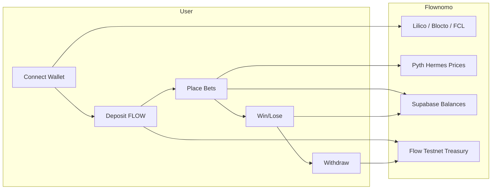
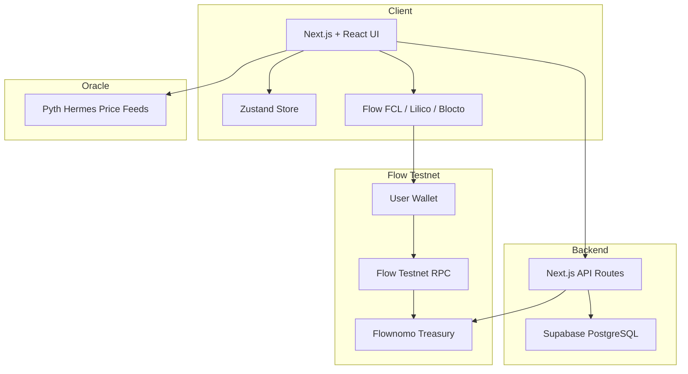
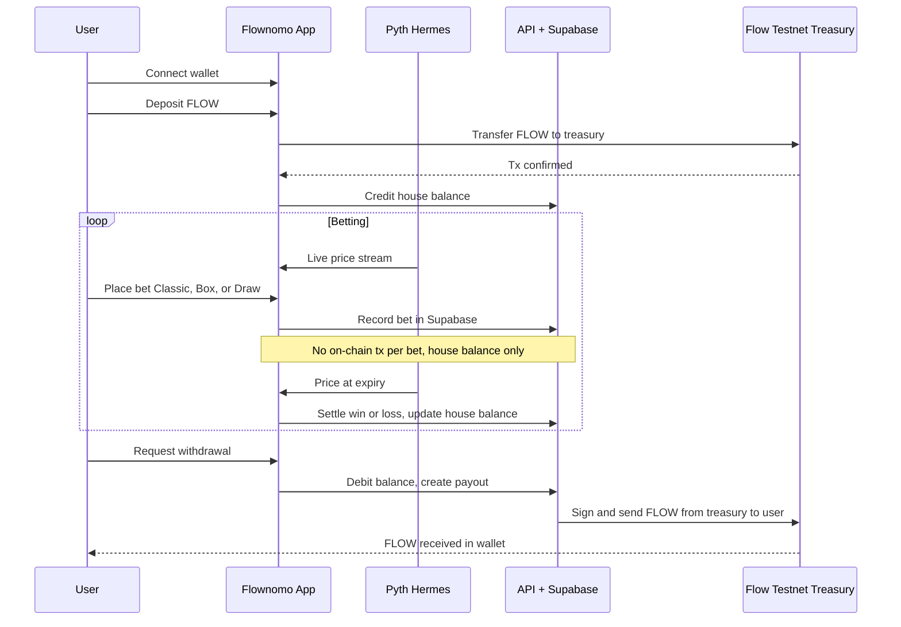
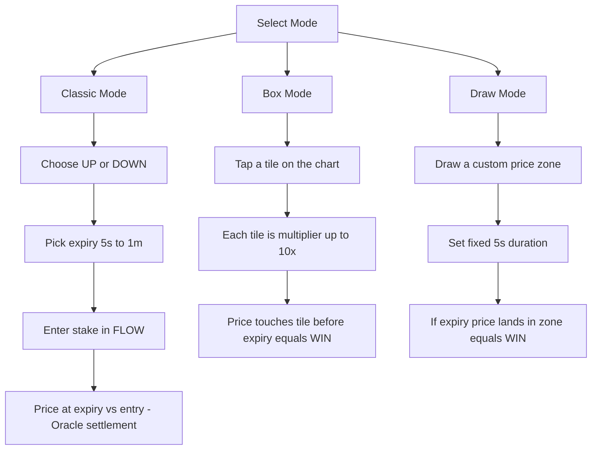

# Flownomo

**The first on-chain binary options trading dApp on Flow Testnet.**  
Running on **Flow Testnet**.

Powered by **Flow Testnet** + **Pyth Hermes** price attestations + **Supabase** + instant house balance.

*Trade binary options with oracle-bound resolution and minimal trust.*

**Treasury (Flow Testnet):** `0xfc2730bbe0bd4941`

| Resource | Link |
|----------|------|
| Flow Testnet Treasury (Flowscan) | [https://testnet.flowscan.io/account/0xfc2730bbe0bd4941?tab=ft-transfers](https://testnet.flowscan.io/account/0xfc2730bbe0bd4941?tab=ft-transfers) |
| Pitch Deck | [https://docs.google.com/presentation/d/1jP2M__MzN7y5EcMDH2uzCCGs9sFib1a3sc7DDDQqQuw/edit?usp=sharing](https://docs.google.com/presentation/d/1jP2M__MzN7y5EcMDH2uzCCGs9sFib1a3sc7DDDQqQuw/edit?usp=sharing) |
| Live App | [https://flownomo.vercel.app/trade](https://flownomo.vercel.app/trade) |
| Demo Video | [https://youtu.be/BMNB2nN_NtI](https://youtu.be/BMNB2nN_NtI) |

---

## Why Flownomo?

Binary options trading in Web3 is rare. Real-time oracles and sub-second resolution have been the missing piece.

- **Pyth Hermes** delivers millisecond-grade prices for 300+ assets (crypto, stocks, metals, forex).
- **Flow Testnet** — low fees and fast finality for deposits and withdrawals.
- **House balance** — place unlimited bets without signing a transaction every time; only deposit/withdraw hit the chain.
- **5s, 10s, 15s, 30s, 1m** rounds with oracle-bound settlement.

Flownomo brings binary options to Flow Testnet with transparent, on-chain settlement.

---

## Story / Inspiration

In 2021, I saw heavy promotion of a Web2 binary options app. I first used paper trading mode and quickly made 10x, then switched to real mode, deposited three months of income, and lost everything. Later, I found large Reddit threads from users reporting similar patterns: trial-mode wins, real-mode losses, opaque systems, and alleged manipulation.

That experience became the reason Flownomo exists: build a transparent binary options product where pricing and settlement are verifiable instead of black-box.

At that time, Web3 tooling was not ready for true high-frequency binary options. Sub-second oracle infrastructure was missing. I waited for the stack to mature, then executed in 2026 with Flow + Pyth.

## Problem

Binary options in Web3 are still underdeveloped, while many Web2 platforms are opaque and trust-heavy.

- Real-time oracle delivery below 1 second has historically been limited.
- During major volatility events, oracle and infra stress can break user trust.
- Massive demand already exists: ~590M+ crypto users and very high daily blockchain transaction activity.
- Result: a clear gap between trader demand and trustworthy high-frequency products.

## Solution - Flownomo

Flownomo is designed as a high-frequency, oracle-settled binary options platform:

- Millisecond-aware pricing via Pyth Hermes.
- Multi-asset exposure (crypto, stocks, metals, forex, and more).
- House-balance execution so users can place many bets without signing each transaction.
- Fast expiries: `5s`, `10s`, `15s`, `30s`, `1m`.
- Single treasury model with transparent settlement rails.

Vision path:

- Add `1x-10x` leverage primitives.
- Expand open-market trading design for broader crypto execution styles.
- Push settlement performance and UX to near-instant user feedback.

## Primary Customer

- **DeFi-native traders onchain**: users already active in spot/perps/options/DEX flows looking for very short timeframes.
- **Web2 binary/prediction users moving to Web3**: users from platforms like Binomo, IQ Option, Polymarket, Kalshi seeking transparent settlement.
- **Traders, gamblers, creators, and communities**: KOL-led groups and Telegram/Discord communities wanting gamified high-speed trading experiences.

## Long-Term Objective

Build Flownomo into the leading on-chain venue for short-duration binary options, with the ambition to become for binary options what Polymarket became for prediction markets.

---

## Tech Stack

| Layer        | Technology |
|-------------|------------|
| **Frontend** | Next.js 16, React 19, TypeScript, Tailwind CSS, Zustand, Recharts |
| **Blockchain** | **Flow Testnet**, FCL, Lilico, Blocto |
| **Oracle** | Pyth Network Hermes (real-time prices) |
| **Backend** | Next.js API Routes, Supabase (PostgreSQL) |
| **Payments** | FLOW native transfers on Flow Testnet, single treasury |

---

## Market Opportunity

| Metric | Value |
|--------|--------|
| **Binary options / prediction (TAM)** | $27.56B (2025) → ~$116B by 2034 (19.8% CAGR) |
| **Crypto prediction markets** | $45B+ annual volume (Polymarket, Kalshi, on-chain) |
| **Crypto derivatives volume** | $86T+ annually (2025) |
| **Crypto users** | 590M+ worldwide |

---

## Competitive Landscape

| Segment | Examples | Limitation vs Flownomo |
|--------|----------|------------------------|
| **Web2 binary options** | Binomo, IQ Option, Quotex | Opaque pricing, no on-chain settlement; users do not custody funds. |
| **Crypto prediction markets** | Polymarket, Kalshi, Azuro | Event/outcome markets (e.g. "Will X happen?"), not sub-minute **price** binary options; resolution in hours or days. |
| **Crypto derivatives (CEX)** | Binance Futures, Bybit, OKX | Leveraged perps and positions; not short-duration binary options (5s–1m) with oracle-bound resolution. |
| **On-chain options / DeFi** | Dopex, Lyra, Premia | Standard options (calls/puts), complex UX; no simple "price up/down in 30s" binary product. |
| **Flow Testnet binary options** | — | No established on-chain binary options dApp; Flownomo fills this gap. |

**Flownomo's differentiation:** On-chain binary options on Flow Testnet with sub-second oracle resolution (Pyth Hermes), house balance for instant bets, and three modes (Classic + Box + Draw) in one treasury.

---

## Future

Endless possibilities across:

- **Stocks, Forex** — Expand beyond crypto into traditional markets via oracles.
- **Options** — Standard options (calls/puts) on top of the same infrastructure.
- **Derivatives & Futures** — More products for advanced traders.
- **DEX** — Deeper DeFi integration and on-chain liquidity.

**Ultimate objective:** To become the go-to on-chain venue for short-duration, oracle-settled binary options on Flow Testnet and beyond.

---

## How It Works



### Flow

1. **Connect** — Connect via Flow wallets (Lilico, Blocto, FCL). All operations use **FLOW** on Flow Testnet.
2. **Deposit** — Send FLOW from your wallet to the Flownomo treasury. Your house balance is credited instantly.
3. **Place bet** — Choose **Classic** (up/down + expiry), **Box** (tap tiles with multipliers), or **Draw** (draw your target zone). No on-chain tx per bet.
4. **Resolution** — Pyth Hermes provides the price at expiry; win/loss is applied to your house balance.
5. **Withdraw** — Request withdrawal; FLOW is sent from the treasury to your wallet on Flow Testnet.

---

## System Architecture



### Data Flow



### Game Modes



---

## Getting Started

### Prerequisites

- Node.js 18+
- Yarn (or npm)
- A Flow wallet (e.g. Lilico, Blocto) and some FLOW on Flow testnet (e.g. from a faucet)
- Supabase project

### 1. Clone and install

```bash
git clone https://github.com/AmaanSayyad/Flownomo.git
cd Flownomo
yarn install
```

### 2. Environment variables

```bash
cp .env.example .env
```

Edit `.env` with:

| Variable | Description |
|----------|-------------|
| `NEXT_PUBLIC_FLOW_NETWORK` | `testnet` |
| `NEXT_PUBLIC_TESTNET_ACCESS_NODE` | Flow testnet access node URL |
| `NEXT_PUBLIC_TESTNET_DISCOVERY_WALLET` | Flow testnet discovery wallet URL |
| `NEXT_PUBLIC_FLOW_TREASURY_ADDRESS` | Treasury address for deposits/withdrawals |
| `FLOW_TREASURY_ADDRESS` | Same as above (backend) |
| `FLOW_TREASURY_PRIVATE_KEY` | Treasury private key (withdrawals; backend only; keep secret) |
| `NEXT_PUBLIC_APP_NAME` | App name shown in the UI (default: `Flownomo`) |
| `NEXT_PUBLIC_ROUND_DURATION` | Default round duration in seconds (e.g. `30`) |
| `NEXT_PUBLIC_PRICE_UPDATE_INTERVAL` | Price refresh interval in ms (e.g. `1000`) |
| `NEXT_PUBLIC_CHART_TIME_WINDOW` | Chart time window in ms (e.g. `300000`) |
| `NEXT_PUBLIC_SUPABASE_URL` | Supabase project URL |
| `NEXT_PUBLIC_SUPABASE_ANON_KEY` | Supabase anon key |

### 3. Supabase

1. Create a project at [supabase.com](https://supabase.com).
2. Run the SQL migrations in `supabase/migrations/` in the Supabase SQL Editor.

### 4. Run the app

```bash
yarn dev
```

Open [http://localhost:3000](http://localhost:3000); the app redirects to `/trade`.

---

## Flow Testnet

Flownomo is built for **Flow Testnet**:

- **FLOW only** — Deposits and withdrawals are native FLOW transfers on Flow Testnet. House balance is tracked in FLOW.
- **Treasury** — Flow Testnet account; receives deposits and sends withdrawals.
- **Wallets** — Connect via FCL (Lilico, Blocto, etc.) to Flow Testnet.
